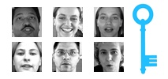
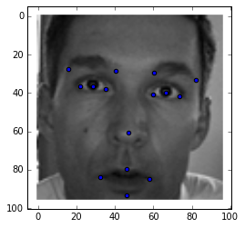

# Machine Learning Engineer Nanodegree
## Capstone Proposal
Pengfei Shi  
Feb 27th, 2017

## Proposal
This capstone proposal is chosen from Kaggle competition: **Facial Keypoints Detection**. The official homepage of this competition is: [https://www.kaggle.com/c/facial-keypoints-detection](https://www.kaggle.com/c/facial-keypoints-detection).

### Domain Backgroundex

Computer vision is a very important technology, and it has been applied in many areas. The objective of this task is to predict keypoint positions on face images. This can be used as a building block in several applications, such as:

- tracking faces in images and video
- analysing facial expressions
- detecting dysmorphic facial signs for medical diagnosis
- biometrics / face recognition
<div align=center>

</div>

Detecing facial keypoints is a very challenging problem.  Facial features vary greatly from one individual to another, and even for a single individual, there is a large amount of variation due to 3D pose, size, position, viewing angle, and illumination conditions. Computer vision research has come a long way in addressing these difficulties, but there remain many opportunities for improvement.

In my **Image Processing** course, our professor had given us an introduction in this area, which are widely used in computer vision, so I want to choose this topic for my capstone project.

### Problem Statement
The aim of this competition is to detect the location of keypoints on face images.

There are 15 keypoints need to be located, each predicted keypoint is specified by an $(x,y)$ real-valued pair in the space of pixel indices, which represent the following elements of the face:

left\_eye\_center, right\_eye\_center, left\_eye\_inner\_corner, left\_eye\_outer\_corner, right\_eye\_inner\_corner, right\_eye\_outer\_corner, left\_eyebrow\_inner\_end, left\_eyebrow\_outer\_end, right\_eyebrow\_inner\_end, right\_eyebrow\_outer\_end, nose\_tip, mouth\_left\_corner, mouth\_right\_corner, mouth\_center\_top\_lip, mouth\_center\_bottom\_lip.

Left and right here refers to the point of view of the subject.

The input image is consists of a list of pixels (ordered by row), as integers in (0,255). The images are (96x96) pixels.

We need to use the given images as the inputs, and the given keypoints as outputs to get a prediction model, and use this model to predict the test dataset.

### Datasets and Inputs

This competition gives us three data files:

- **training.csv**: list of training 7049 images. Each row contains the (x,y) coordinates for 15 keypoints, and image data as row-ordered list of pixels.
- **test.csv**: list of 1783 test images. Each row contains ImageId and image data as row-ordered list of pixels
- **submissionFileFormat.csv**: list of 27124 keypoints to predict. Each row contains a RowId, ImageId, FeatureName, Location. FeatureName are "left\_eye\_center\_x," "right\_eyebrow\_outer\_end\_y," etc. Location is what you need to predict. 

In some examples, some of the target keypoint positions are misssing (encoded as missing entries in the csv, i.e., with nothing between two commas).

- **For training parts**: inputs are (96*96) images in **training.csv**, and the labels are 15 keypoints for outputs in **training.csv**.

- **For testing parts**: inputs are (96*96) images in **test.csv**, and the prediction results should be stored in **submissionFileFormat.csv** for submitting to Kaggle.

### Solution Statement

This task is complex to train the model, because it has large scale high-dimension input data, and the multiple outputs. **Convolutional neural networks (CNN)** is a powerful matching learning method for solving this kind of problems, which data are in high-dimension, and it has been proved very useful. Also, CNN can be combined with GPU for parallel computing, which can help accelerate computing for saving the model training time. The tool I will choose **Tensorflow**, which is an open-source software library for machine intelligence. And it has been widely used in many companies.

### Benchmark Model

The total training data are 7049 images. Shuffle the training dataset for model training, and split 5% images (about 350) for cross validation. Record the training loss and validation loss according to the metrics, and Plot them into one figure in each training iteration. Find the properties of cross validation loss, and choose the best one for the model.

### Evaluation Metrics

According to the official competition judgements, it uses **Root Mean Squared Error (RMSE)** for metric.

RMSE is commonly used general-purpose error metric. In this case, the position of keypoints are high-dimension data, so this metric is suitable. Compared to Mean Absolute Error (MAE), it will punish large errors, the description is shown in below:

\\[
RMSE=\sqrt{\frac{1}{n}\sum_{i=1}^{n}(y_i- \hat{y}_i)^2}
\\]

where $\hat{y_i}$ is the predicted value and $y_i$ is the original value.

### Project Design

- Setup the basic programming environments, and configure the library for use: Numpy, Pandas, Tensorflow.

- Download three data file for test, and load them into python variables using ```pd.Dataframe()```.

- Explorate the data, the figure in the below is an example, the gray picture is one person face, and the blue point are the marked keypoints in face.
<div align=center>

</div>

- Do some actions for preprocessing, drop the nan data, and reshape the image data (because the origin image data is one list which is row-ordered).
- Shuffle and split data for creating validation dataset for test. And because of the large num of images, in order to train the model efficiently, we may need to divide the data into some batches, and load them into tensorflow initial variables.

- The most important part, design the CNN model, CNN model consists of many layers. How many convolutional layers, what the size of each convolutional kernels and where to put the max-pooling layer,.etc, these are all need take into consideration. So a good model leverages very about all these components. And these may need a lot of attempts, and choose the least cost model in validation dataset.
-  Use the trained model to predict the testing dataset, and upload the results into Kaggle platform for judgements.
### References

1. Kaggle Competition HomePage: https://www.kaggle.com/c/facial-keypoints-detection.
2. CNN tutorial in deepleanring.net: http://deeplearning.net/tutorial/lenet.html
3. Udacity deep learing course: https://www.udacity.com/course/deep-learning--ud730